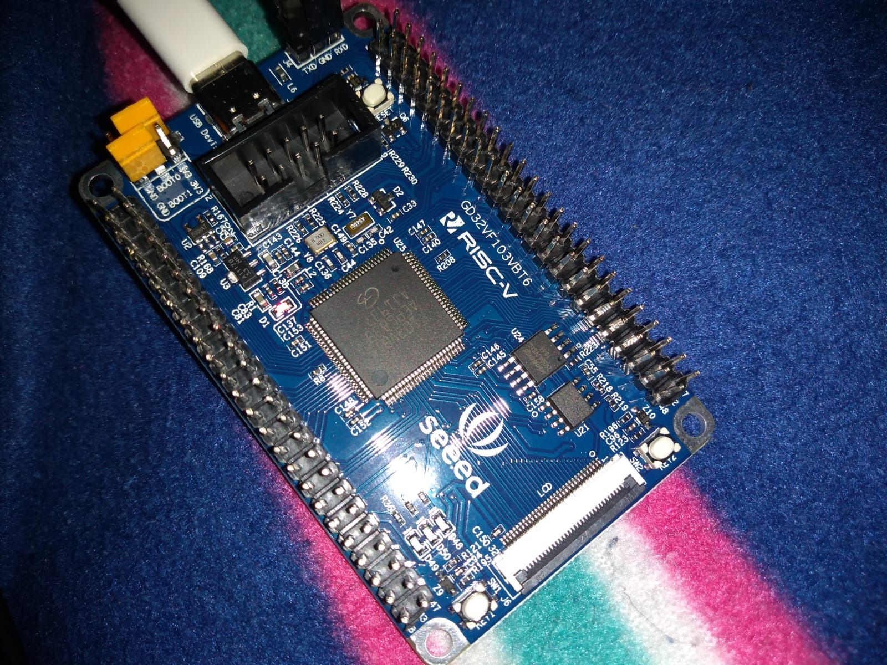

Initial tests with a [GD32VF103VBT6](https://www.seeedstudio.com/SeeedStudio-GD32-RISC-V-Dev-Board-p-4302.html)
RISC-V development board:

The code is basically executing the Dhrystone benchmark,
with the output sent to the serial pins of the board 
at 115200 baud.

click on the image below to see a video of the execution:

The board needs to be set to DFU mode (BOOT0 jumper high, 
BOOT1 low) - then a simple `make` will build the code
(using `riscv64-unknown-elf-gcc`) and upload it to the
board using `dfu-util`. At the end of the upload, the
benchmarks starts executing immediately, and reports this:

    Dhrystone Benchmark, Version 2.1 (Language: C)
    Execution starts...
    
    Final values of the variables used in the benchmark:
    
    Int_Glob:            5
            should be:   5
    Bool_Glob:           1
            should be:   1
    Ch_1_Glob:           A
            should be:   A
    Ch_2_Glob:           B
            should be:   B
    Arr_1_Glob[8]:       7
            should be:   7
    Arr_2_Glob[8][7]:    1000010
            should be:   Number_Of_Runs + 10
    Ptr_Glob->
      Ptr_Comp:          536871000
            should be:   (implementation-dependent)
    Discr:             0
          should be:   0
    Enum_Comp:         2
          should be:   2
    Int_Comp:          17
          should be:   17
    Str_Comp:          DHRYSTONE PROGRAM, SOME STRING
          should be:   DHRYSTONE PROGRAM, SOME STRING
    Ptr_Comp:          536871000
          should be:   (implementation-dependent), same as above
    Discr:             0
          should be:   0
    Enum_Comp:         1
          should be:   1
    Int_Comp:          18
          should be:   18
    Str_Comp:          DHRYSTONE PROGRAM, SOME STRING
          should be:   DHRYSTONE PROGRAM, SOME STRING
    Int_1_Loc:           5
            should be:   5
    Int_2_Loc:           13
            should be:   13
    Int_3_Loc:           7
            should be:   7
    Enum_Loc:            1
            should be:   1
    Str_1_Loc:           DHRYSTONE PROGRAM, 1'ST STRING
            should be:   DHRYSTONE PROGRAM, 1'ST STRING
    Str_2_Loc:           DHRYSTONE PROGRAM, 2'ND STRING
            should be:   DHRYSTONE PROGRAM, 2'ND STRING
    
    Execution ends (after 9687 ms)
    Microseconds for one run through Dhrystone: 9
    Dhrystones per Second: 103231
    VAX MIPS rating = 58

